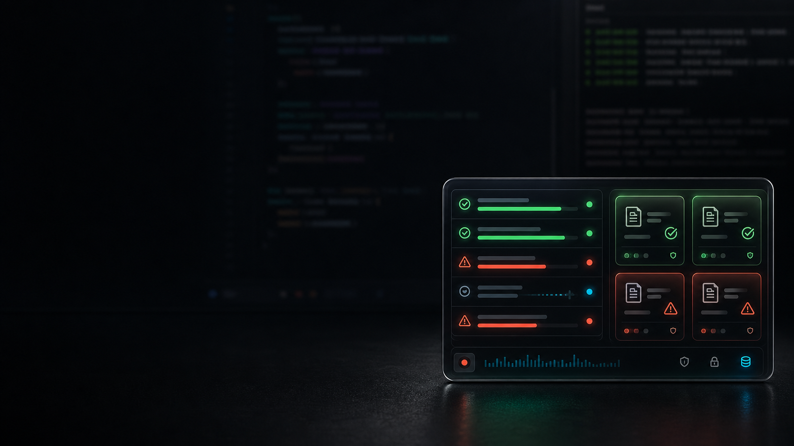

# Vibe-Dashcam

## AI Skills Are Burning Your Tokens. Keep the Receipt.



Vibe-Dashcam is a small local desktop dashcam for Codex. It watches Codex Skill/MCP signals, keeps a lightweight red/black board in the corner of your screen, and saves a local receipt when a Skill or MCP path looks like it wasted model time.

It is not a cloud platform. It is not an agent marketplace. It is not trying to judge every AI mistake.

It does one ugly job first:

> Catch real Codex Skill/MCP failure evidence before the context disappears.

## What It Catches

Vibe-Dashcam only cares about cases with Skill/MCP involvement.

| Signal | What it means | What the HUD shows |
| --- | --- | --- |
| Skill evidence | Codex reads a `SKILL.md` file | clean or failed Skill row |
| MCP evidence | Codex calls an `mcp__server.tool` style tool | clean or failed MCP row |
| Hard failure | nonzero exit, MCP error, timeout, traceback, permission denial, failed tool call | failed receipt first, review later |
| Soft failure | user pushes back after Skill/MCP activity: "wrong", "undo", "不对", "撤销" | rebuttal receipt |

No Skill/MCP signal, no blame. Normal model mistakes stay out of the board.

## How It Works

1. You open the tiny desktop HUD.
2. The local core tails `~/.codex/sessions` and accepts optional Codex hook summaries on `localhost:8080`.
3. Local rules flag only Skill/MCP-related candidates.
4. For real flagged cases, Vibe-Dashcam can run one short local review through your own Codex CLI:

```powershell
codex exec --ephemeral --sandbox read-only --output-schema <schema> -
```

If you select a review model in the HUD, it passes that model to Codex:

```powershell
codex exec --model <model> --ephemeral --sandbox read-only --output-schema <schema> -
```

The review receives a redacted short case summary, not your full repo.

## Current Beta

- Codex-only.
- Windows desktop beta first.
- Bottom-right HUD, not a big dashboard.
- Real data only in the main board; demo samples stay isolated.
- Today / All-time stats.
- Clickable success and failure rows.
- Saved local receipts restored after restart.
- Local config check from the settings panel.
- Review model list read from local Codex model/config/profile data.
- Windows package bundles the Python core, so normal users do not need Python.

## Privacy Boundary

Vibe-Dashcam stays boring on purpose:

- No account.
- No cloud upload.
- No public leaderboard upload.
- No OpenAI/Anthropic/Spark API key.
- No `.env` reading.
- No full source-file capture.
- No Windows startup or Codex auto-launch hook.

Real flagged cases are auto-saved locally:

```text
%LOCALAPPDATA%\VibeDashcam\cases.jsonl
```

Hook configuration lives locally:

```text
%LOCALAPPDATA%\VibeDashcam\config.json
```

## Run From Source

PowerShell:

```powershell
cd .\desktop
npm install
npm run tauri dev
```

Development requires Node.js, Rust/Cargo, Python, and PyInstaller.

## Build Windows Installer

```powershell
cd .\desktop
npm run release:windows
```

The installer is generated at:

```text
desktop\src-tauri\target\release\bundle\nsis\Vibe-Dashcam_0.1.0_x64-setup.exe
```

## Optional Codex Hook

Codex session tailing works without a custom hook. A hook is only an extra signal path when session logs are not enough.

The hook must:

- POST only to `http://localhost:8080/hook`.
- Include `X-Vibe-Dashcam-Token` from the local config.
- Send tiny summaries only.
- Fail silently when Dashcam is closed.
- Never start Dashcam, never install startup items, never send secrets.

Example:

```json
{
  "client": "codex",
  "source_kind": "hook",
  "event_type": "McpToolUse",
  "user_input": "optional short prompt summary",
  "ai_output": "short error or assistant summary",
  "skill_name": "optional-skill-name",
  "tool_name": "mcp__server.tool",
  "call_id": "optional-tool-call-id",
  "model": "optional-current-model",
  "token_count": 120
}
```

See [`examples/codex/vibe_dashcam_hook.py`](examples/codex/vibe_dashcam_hook.py) and [`vibe_dashcam/INSTALL_FOR_AGENT.md`](vibe_dashcam/INSTALL_FOR_AGENT.md).

## 中文简介

Vibe-Dashcam 是一个本地 Codex 行车记录仪。它不是大平台，不做账号，不上传云端，也不假装能判断所有 AI 错误。

它只先盯一个最贵的地方：

> Codex 里的 Skill / MCP 到底有没有在真实使用里翻车。

土狗规则：

1. 先看到 Skill/MCP 参与，才进入观察窗口。
2. Skill/MCP 自己报错、超时、失败，就是硬失败。
3. Skill/MCP 之后用户说“不对、撤销、重来”，就是软失败。
4. 没有 Skill/MCP 证据，就不乱扣锅。

硬失败会先立刻显示在右下角小窗里；随后本机 Codex 可以读一小段脱敏上下文，给出一句话复核。复核走用户自己的 `codex exec`，不需要新的 API Key。

本地记录会保存在 `%LOCALAPPDATA%\VibeDashcam\cases.jsonl`，重启后还能看到历史。主榜单只显示真实数据，demo 不混进去。

## License

MIT
