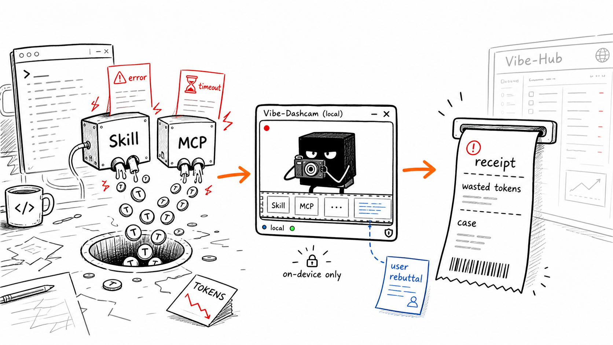

# Vibe-Dashcam

## AI Skills Are Burning Your Tokens. Keep the Receipt.



Vibe-Dashcam is a local desktop dashcam for Codex. It watches tiny local summaries from your Codex session, then turns suspicious Skill/MCP failures into a reviewable local case.

The first target is not "all AI mistakes". The first target is narrower and meaner:

> When a Skill or MCP server wastes expensive model time, catch the evidence before the context disappears.

## The Degen Rule

Do not build a giant lab before you can catch the crash.

Vibe-Dashcam keeps the rule simple:

1. A Skill/MCP signal opens a short observation window.
2. Tool-crash evidence becomes a case when the Skill/MCP itself leaves an error trail.
3. User-rebuttal evidence becomes a case when the user pushes back after that Skill/MCP was active.
4. No Skill/MCP signal, no public blame.

That keeps normal model mistakes separate from tool, Skill, and MCP failures.

## Two Evidence Triggers

Tool-crash evidence:

- The Skill/MCP reports `error`, `timeout`, `failed`, nonzero exit, exception, MCP error, or similar.
- Dashcam marks a crash-evidence candidate immediately, shows it in the HUD, then lets the local Codex review read the short surrounding context and revise the one-line verdict if needed.

User-rebuttal evidence:

- A Skill/MCP was active.
- The next user input says things like "wrong", "undo", "not like this", "不对", "重来", "撤销".
- Dashcam marks a rebuttal-evidence candidate because the tool path likely drifted.

The current build uses conservative local rules first. When a real flagged case exists, Dashcam runs one short local Codex review through `codex exec` and stores that review on the same local receipt. The review model defaults to the user's Codex config; the HUD reads the local Codex model catalog with `codex debug models`, merges any config/profile model values, and passes the selected value through with `codex exec --model <model>`.

## Current Local Build

- Runs locally and listens on `http://localhost:8080/hook`.
- Ships a Tauri + React desktop HUD designed as a small bottom-right red/black board.
- Starts the local evidence core automatically from the desktop app when port 8080 is not already active.
- Bundles the local evidence core into the Windows desktop package, so users do not need to install Python.
- Watches local Codex session JSONL files as the default no-trust path.
- Still works as `Hook only` when Codex session logs are not available.
- Accepts optional short Codex hook summaries when session logs are not enough; hook writes require the local `hook_token` from `%LOCALAPPDATA%\VibeDashcam\config.json`.
- Treats Codex `SKILL.md` reads as Skill evidence, not an official Skill activation API.
- Detects MCP calls from `mcp__...` tool namespaces and MCP event summaries.
- Keeps only the latest 12 field-whitelisted, truncated, secret-redacted behavior summaries.
- Auto-saves real flagged cases to `%LOCALAPPDATA%\VibeDashcam\cases.jsonl`.
- Shows Skill/MCP clean/flagged counts, latest estimated receipt, saved cases, export, copy receipt, and pause.
- Restores saved cases after restart, can switch visible stats between Today and All-time, and can clear old history while keeping today's receipts.
- Starts recording only after the user opens Dashcam; it does not auto-launch from Codex or install a Windows startup shortcut.
- Reviews flagged real cases with the user's local `codex exec --ephemeral --sandbox read-only` path when Codex CLI is available, using the default Codex model or the user's selected review model.
- Does not ask for API keys.
- Does not read `.env`.
- Does not create accounts, upload to cloud, or sync data.
- Local only. Nothing leaves this machine.

## Run On Windows

PowerShell:

```powershell
cd .\desktop
npm install
npm run tauri dev
```

Development requires Node.js, Rust/Cargo, Python, and PyInstaller. The packaged Windows app bundles the local core. For a frontend-only build check:

```powershell
cd .\desktop
npm install
npm run build
```

## Codex Hook Payload

Codex can be watched from local session logs after Dashcam is open. A Codex hook can also POST a small JSON payload to `/hook`.

Send less, not more. Never send secrets or full source files. The hook must not launch Dashcam; it only reports to an already-running local app.
Hook POSTs must include `X-Vibe-Dashcam-Token` with the local `hook_token` generated in Dashcam's config file.

```json
{
  "client": "codex",
  "event_type": "McpToolUse",
  "user_input": "optional user prompt summary",
  "ai_output": "short error or assistant summary",
  "skill_name": "optional-skill-name",
  "tool_name": "mcp__server.tool",
  "token_count": 120
}
```

Dashcam keeps only these fields: `client`, `source_kind`, `event_type`, `user_input`, `ai_output`, `skill_name`, `skill_evidence`, `tool_name`, `call_id`, `model`, `token_count`. Text fields are truncated and common secret patterns are replaced before display or local save.

## Package

Windows release:

```powershell
cd .\desktop
npm run release:windows
```

The default Windows release creates one ordinary installer:

```text
desktop\src-tauri\target\release\bundle\nsis\Vibe-Dashcam_0.1.0_x64-setup.exe
```

The installer bundles the local evidence core, so normal users do not need Python. Build machines still need Node.js, Rust/Cargo, Python, and PyInstaller because the release package embeds the Python core as a sidecar.

MSI is not built by default. The beta release target is the NSIS setup exe because it is the clearest path for ordinary Windows users.

## Boundary

This is a small local Codex tool. It only creates local evidence cards for Codex Skill/MCP activity.

---

# 中文版

## 震惊：你的 AI Skill 可能在偷偷烧 Token，先把账单拍下来

Vibe-Dashcam 是一个本地 Codex 行车记录仪。它不做重型评测平台，不搞全仓库回放，也不假装能判断所有代码对错。它只先盯住最值钱的一层：Codex 里的 Skill 和 MCP 有没有在真实使用里翻车。

土狗规则很简单：

1. 先看到 Skill/MCP 参与，才进入观察窗口。
2. Skill/MCP 自己报错、超时、失败，就是工具崩溃证据。
3. Skill/MCP 跑完后用户说“不对、重来、撤销”，就是用户驳斥证据。
4. 没摸到 Skill/MCP，就不乱扣锅。

当前版本就是一个本地小工具：先用本地规则抓 Skill/MCP 候选，硬失败先立刻显示，后台再让本机 `codex exec` 读一小段脱敏上下文做短复核。复核模型默认用用户自己的 Codex 配置；小窗会优先从本机 `codex debug models` 读取模型目录，再合并 Codex 配置/profile 里写过的模型。选了以后只是给 `codex exec` 加 `--model`。它不要新 API Key，不读 `.env`，不上传，不搞账号。
